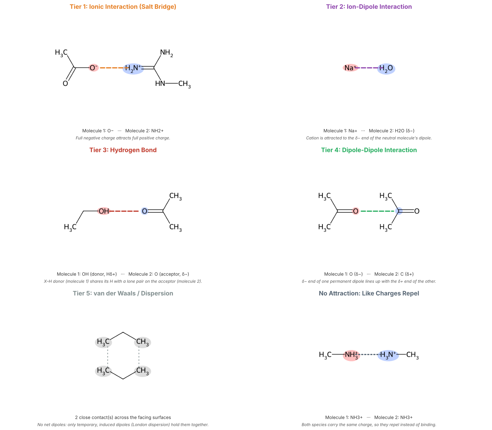

# Molecular Interaction Explorer (Google Colab)

**Author:** Dr. Sunil Paliwal, Department of Chemistry and Chemical Biology, Stevens Institute of Technology

**Status:** Developed for teaching drug discovery and medicinal chemistry.

## Overview

Students often find it hard to tell which non-covalent interaction two molecules can form, and which atoms take part. This notebook lets them type two molecules as SMILES and see:

- the **strongest** interaction the pair can make, ranked in five tiers;
- the two molecules drawn facing each other, with the interacting atoms highlighted;
- the role of each atom (H-bond donor or acceptor, δ+ or δ−);
- a one-line explanation of why that interaction applies.

| Tier | Interaction | What the tool looks for | Example |
|---|---|---|---|
| 1 | Ionic / salt bridge | Opposite full charges | `CC(=O)[O-]` + `CNC(=[NH2+])N` |
| 2 | Ion–dipole | One ion + a polar neutral molecule | `[Na+]` + `O` |
| 3 | Hydrogen bond | O–H or N–H donor ··· O or N lone-pair acceptor | `CCO` + `CC(C)=O` |
| 4 | Dipole–dipole | Both molecules have a net dipole | `CC(C)=O` + `CC(C)=O` |
| 5 | van der Waals / dispersion | Nonpolar molecules, or polar bonds that cancel by symmetry | `CCC` + `CCC`, `O=C=O` + `O=C=O` |
| – | Like charges repel | Two ions of the same sign | `C[NH3+]` + `C[NH3+]` |

## Quick start

1. **Open the notebook.** [Click here to open the notebook in Google Colab](https://colab.research.google.com/github/Sunil-Paliwal/molecular-interaction-explorer-colab/blob/main/Molecular_Interaction_Explorer_Colab.ipynb) and sign in with a Google account.
2. **Run the cells in order.** Cell 1 installs RDKit (about 30 seconds). Cell 2 loads the tool and shows two input boxes.
3. **Analyze a pair.** Enter a SMILES string in each box and click **Analyze Interaction**. Try the examples in the table above.

No local installation is needed.

## How it decides

- **Charges:** formal charges are counted as real ions, except charges that cancel on bonded atoms (nitro groups, N-oxides), which are neutral groups drawn with + and −. Zwitterions such as glycine are treated as ions.
- **Polarity:** each molecule's net dipole is estimated from a 3D conformer and Gasteiger partial charges (RDKit). Molecules below 0.2 D, such as CO₂ and CCl₄, count as nonpolar.
- **Hydrogen bonds:** donors are O–H and N–H; acceptors are carbonyl O, pyridine-type N, amine N, alcohol/ether O, imine N and nitrile N. Amide and aniline nitrogens are not used as acceptors.
- **Dispersion:** drawn as several contacts across the facing surfaces rather than a single atom pair.

## Limitations

This is a teaching tool, not a docking or energy calculation.

- It shows only the **strongest** interaction. Real pairs usually make several at once.
- Partial charges and dipoles are fast estimates, not quantum-chemical values.
- Geometry is a 2D drawing. It does not model 3D shape, conformations, solvent, or π-stacking energetics.
- The input is two molecules. It does not analyze protein–ligand complexes.

## Built with

- [RDKit](https://www.rdkit.org/) for cheminformatics and drawing (BSD license)
- Matplotlib, Pillow and ipywidgets in Google Colab

## License

MIT License. See [LICENSE](LICENSE).

## How to cite

If you use this notebook in teaching or publications, please cite:

> Paliwal, S. *Molecular Interaction Explorer (Google Colab).* GitHub, 2026. https://github.com/Sunil-Paliwal/molecular-interaction-explorer-colab
